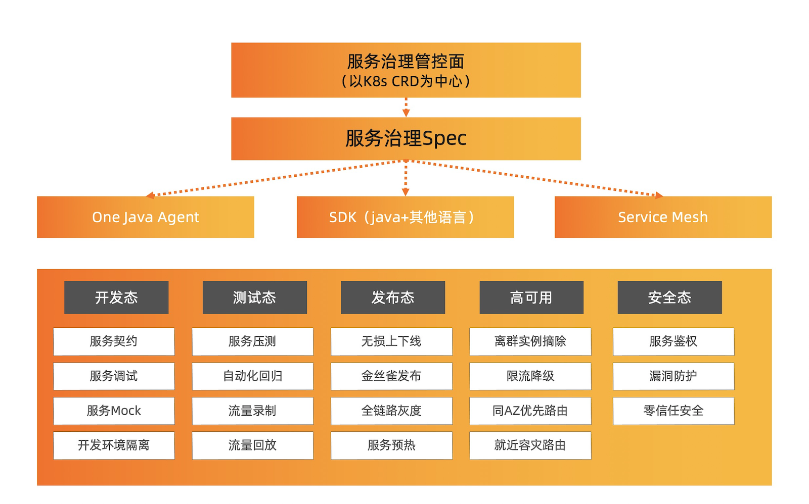
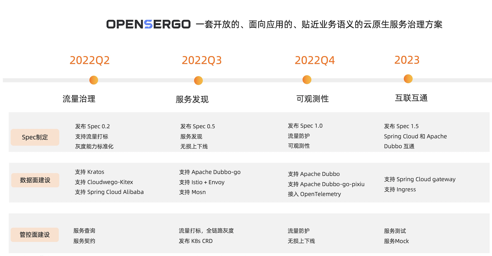

## 背景

软件架构的核心挑战是解决业务快速增长带来的系统复杂性问题。系统越复杂，对服务治理诉求越强烈，小的技术问题越可能被放大，从而造成大的线上故障。而微服务治理就是通过无损上线下、全链路灰度、流量防护等技术手段来减少、甚至避免发布和管理大规模应用过程中遇到的稳定性问题。

虽然大家都认为微服务治理很重要，但在落地过程中会遇到各种难题。

例如，在企业内部，往往存在着不同语言、不同通信协议的微服务，这会导致治理微服务的过程中，给业务开发者、架构师平添很多的认知负担，而这类异构会衍生出更多的痛点。

* 业内对服务治理的能力和边界没有明确的认识，每个企业所定义的服务治理概念不一致，造成很高的理解和沟通成本。
* 开源微服务框架众多，对于服务治理缺乏一些标准化的约定。例如，Spring Cloud 中定义的微服务接口和 Dubbo 中定义的接口就没有办法互通，通过 Dubbo 和 Istio 管理的微服务也没有办法进行统一治理。
* 缺少真正面向业务、能够减轻认知负担的抽象和标准。开发者真正想要的可能是简单的、指定服务间的调用关系和配置规则。但现在对于业务开发者来说，不仅需要了解不同微服务框架的部署架构，也要了解不同服务治理方式的概念和能力区别，认知成本很大。

## 企业级微服务治理实践

### 阿里巴巴的微服务实践

在阿里巴巴内部，服务治理体系从形态上经历了从 SDK 方式、到 Fat-SDK 方式、再到 Java Agent/Sidecar 化的演进历程。具体而言，阿里巴巴从 2008 年就开始了微服务的改造，诞生了服务框架 HSF 及配套的服务治理能力；2012 年，Dubbo 框架开源，提供了非常优秀的服务治理能力，这个阶段的服务治理能力是以 SDK 的方式和服务框架进行一体化演进的；2013 年开始，为了解决 SDK 升级成本高的问题，中间件团队推出轻量级隔离容器 Pandora，将服务治理能力通过 Fat-SDK 的方式从业务中剥离出来，大幅度提升了升级效率。

然而这种方式仍然面临较高的升级成本。为了将服务治理体系和业务彻底解耦，阿里巴巴从 2019 年开始，通过将服务治理能力下沉到 JavaAgent，实现了完全无需对业务做任何改造、就能接入服务治理的能力。后来，我们将这个技术方案进行产品化，通过阿里云微服务引擎 MSE 这款产品服务云上的企业客户。

同一时期，随着业务发展的多样化，多语言构建的业务在集团内部逐渐流行起来，阿里巴巴内部开始探索多语言的治理方案，采用了基于 Istio + Envoy 的 Sidecar 方式为异构语言服务，提供基础的服务治理能力。

在这个过程中我们逐渐发现，异构微服务框架之间有不同的体系和认知，在很多概念上无法完全对齐，用一套标准的服务治理方案治理各种微服务体系变得愈发困难。因此，我们迫切需要一个和语言无关、和技术形态无关，但贴近业务的统一服务治理规范，使得异构微服务体系能够互联互通以及进行统一治理。

总结下来，阿里巴巴内部的服务治理经历了从基础数据面建设、到治理能力探索、再到能力标准化建设三个阶段。

### bilibili 的微服务实践

从 2016 年开始，bilibili 进行经历巨石架构到微服务的完整转型，整个过程中，也面临了很多服务治理问题。从单体到微服务整个部署和管理模式开始进行转变，我们为了提高研发效率和稳定性拆分了不同粒度的服务，所以我们于 2017 年开始思考如何管理微服务，从而开始通过容器部署和隔离，在管理方面极大地解决了我们的问题，同时也建设了统一的注册中心和配置中心基础中间件，整个微服务也围绕这两个基础中间件做了很多服务治理相关的。

在早期我们语言还是比较统一的，基本上是以 Go 语言为主，有统一的 Kratos 框架，所以服务治理也是优先选择了 SDK 方式进行管控。随着这几年的业务快速发展，内部出现 Java、C++ 等一些语言，我们尝试了 Service Mesh 通过 Sidecar 方式进行管理，在这个过程中我们逐渐发现，整个维护成本其实是不小的，并且性能损耗在降本增效的这个大环境下也有比较大的挑战。所以，我们也非常期待有一套服务治理标准，可以在 Kratos 框架、Java Agent、Istio 等体系中使用。

## 微服务治理的发展趋势

展望未来，微服务治理的发展趋势，是让业务迭代更加高效、业务和治理更加透明和解耦：

* 服务治理数据面透明化、多元化：微服务数据面会逐渐下沉为基础设施，业务开发者会将数据面当作一个标准组件来使用。同时，服务治理也会通过多种形态来支持不同的数据面，对齐服务治理数据面能力。
* 服务治理数据面标准化：微服务框架会直接对接标准的服务治理标准，减轻微服务框架的对接负担；业务开发者也只需要理解标准的服务治理数据面标准，不需要了解底层能力，降低认知负担。
* 数据面实现互操作性：各个微服务框架、各个通信协议提供的能力会标准化，能够让用户用统一的模式来认知和治理。

## OpenSergo 的使命和愿景

基于此，阿里巴巴在2022年1月开始和 bilibili、字节等厂商讨论服务治理如何规范化和更加普及，从而共同发起了 OpenSergo 项目。

我们观察到，目前不同框架、不同语言在微服务治理上的概念碎片化、无法互通。所以，OpenSergo 致力于在不同的微服务框架、通信协议之间达成共识，形成服务治理规范。

* 让业务开发者，不会因为不同的语言、不同的框架而产生割裂。
* 让架构师，能够用统一的规范来描述自己内部的微服务架构。
* 让中间件开发者，能够和现有微服务框架对齐，增强微服务框架之间的互操作能力，促进微服务框架在企业落地。

## OpenSergo 总览

OpenSergo 主要包含三大部分：

* **控制面**：用户可以通过 CRD 或者 Dashboard 的方式查看、修改服务治理配置，并将这些管控信息下发到数据面。

* **数据面**：JavaAgent、Servcie Mesh、各个接入 OpenSergo 的微服务框架都能够接收到服务治理配置，并应用到当前的业务流量中。各个数据面都能够认可OpenSergo规定的服务治理配置、流量标签等信息，确保降低开发者理解成本。

* **OpenSergo Spec**：Spec 规定了控制面和数据面的通信约定，确保用户使用一种 Spec 即可描述不同框架、不同协议、不同语言的微服务架构，让开发者不再需要关注底层差异。

对于控制面，OpenSergo 统一了治理规则，用户不必再绑定到某个开源方案、某个云厂商提供的服务上。不同的数据面、控制面只要对接 OpenSergo 规范，即可无缝对接现有的服务治理体系。

对于数据面，OpenSergo 提供了不同的接入方式：

* Spec/SDK 接入：微服务框架可以通过 OpenSergo 规范实现自助接入。各个框架也可以通过 SDK 简单地接入到 OpenSergo 中，这种接入方式能够获取到更多的框架内部信息，也能够省去 Sidecar 带来的额外性能、资源开销。
* Sidecar 方式接入：对于多语言服务，OpenSergo 可以将服务治理规则下发到 Sidecar 中，以 Sidecar 方式治理现有的微服务应用。
* Java Agent 接入：对于 Java 应用，Java Agent 可以用无侵入的方式将服务治理能力增强到现有的微服务应用中，能够很好地将存量 Java 应用带入到统一的微服务治理体系中来。

从阿里巴巴集团内部和阿里云提供的服务治理经验来看，结合各个开源微服务框架、各公司内部的治理经验，从服务治理功能层面来说，目前业界认可的主要分为上图中的开发态、测试态、发布态、高可用、安全态五个部分：
* 开发态：方便业务开发者了解微服务定义，方便开发调试；提升研发效率，让开发更快捷。
  * 服务契约：能够让各个微服务框架来定义提供了哪些接口、每个接口的参数、以及接口的业务说明；便于开发者迅速了解应用。
  * 服务调试：能够填写入参、迅速发起一个服务调用，不再需要自己写代码。
  * 服务Mock：在开发过程中，能够暂时模拟应用行为，防止应用依赖阻碍开发进度。
  * 开发环境隔离：通过逻辑隔离的方式，为每一个正在开发的功能特性隔离出一个独立的环境， 在低成本的前提下，划分出多个完整的独立环境，使得各功能特性的开发调试不会互相影响， 提升开发迭代的效率。
* 测试态：方便测试人员压测、回归、验证功能；提升测试效率，让测试更快更准更全面。
  * 服务压测：快速发起压测，迅速了解微服务的容量是否偏离基线，确保应用性能
  * 自动化回归：通过自动化的方式进行回归测试，自动发起测试并自动比对结果进行验证，无需人工重复测试，保障业务代码逻辑的正确性
  * 流量录制：将线上流量录制下来，自动生成测试用例进行回归测试，通过真实的请求丰富测试用例
  * 流量回放：将录制好的流量重新运行，验证当前的业务运行结果是否和录制好的请求的结果匹配，保障业务逻辑的正确性
* 发布态：解决业务发布的时候的流量治理问题，让应用发布能够顺畅稳定。
  * 无损下线：确保应用在发布、停止、扩容时，所有请求都不会被影响，确保微服务下线的过程中业务无损。
  * 服务预热：应用刚启动时可能会存在一些资源未初始化完成、未预热完毕的情况，服务预热可以确保在这个场景下不影响业务。
  * 金丝雀发布：满足特定流量特征的请求才会进入微服务的灰度节点，通过小流量验证微服务 新版的逻辑是否符合预期。
  * 全链路灰度：一个迭代的多个应用同时发布，希望经过灰度的上游流量只能达到下游的灰度 节点，确保灰度流量只在灰度环境中流转。
* 高可用：提供限流、降级、熔断等能力，保障业务稳定性、可用性。
  * 限流：针对超过阈值的流量进行限流控制，保障机器和整体业务的稳定性。
  * 降级：在资源有限的情况下，针对某些不重要的请求返回预设的降级结果，把有限的资源让给重要的请求。
  * 熔断：客户端访问后端服务不可用的情况下，返回预先定义的异常或结果，避免引起业务异常，甚至雪崩。
  * 离群实例摘除：在单个服务提供者节点持续不可用的情况下，在消费者侧摘除这个异常节点，保障业务的高可用。
  * 临近路由：微服务多可用区部署的情况下，确保流量优先在同一个可用区内流转，降低业务的整体时延。
  * 就近容灾路由：当某个可用区发生故障，可以把流量尽快的切到正常的可用区，让业务以最快速度恢复。
* 安全态：保护敏感业务、提供零信任能力，保障业务安全。
  * 服务鉴权：保护敏感微服务，确保敏感服务只能被已授权的应用访问和调用。
  * 漏洞防护：微服务框架通常会陆陆续续被发现许多漏洞，整体的升级成本很高，需要通过不升级框架的方式实现漏洞的防护，可以通过流量拦截、动态程序修改等技术来修复和缓解。
  * 配置鉴权：对于敏感配置，不希望任何微服务都有权限访问，控制只有受限的微服务才能访问。

从更大的角度来看，除了微服务框架、Service Mesh、Java Agent 方式的治理之外，服务治理还会关注网关、存储等完整的调用链路；在实现上，也会包括微服务服务发现、配置管理、分布式事务等微服务基础组件的治理和接入。

在图中的子领域中，OpenSergo 会采纳现有的规范、提出落地新的规范，来给业务开发者提供一套标准界面，能够对业务开发者、架构师屏蔽底层差异，让他们专注于核心业务价值，从而真正兑现云原生微服务的价值。

## OpenSergo 减少实施微服务治理时的阻力

OpenSergo 致力于提供统一的服务治理能力，让业务开发者、架构师能够以云原生的方式来定义自己的微服务架构，来满足自己的业务发展，从而减少实施微服务治理时的阻力。

在以往，架构师在设计架构时，总是要考虑各种微服务框架的能力、各种通信协议的差异、各种服务治理带来的能力差异，导致设计时要考虑很多底层的实现，极大的增加了认知负担。业务开发者也要关注当前的微服务框架如何才能满足自己的治理要求、当前的通信协议如何灰度、如何调试、如何限流等。可以预见，业务开发者将耗费很大一部分的精力在微服务框架、服务治理上，在核心业务价值上的投入却少了很多。

OpenSergo 将对底层能力标准化，对架构师、对业务开发者屏蔽底层差异，用更加云原生的方式来治理微服务。架构师只需要用统一的能力模型设计业务架构，而业务开发者也只需要利用统一的能力模型来专注于业务开发。

此外，对于企业而言，现有的微服务治理体系，严重特化于现有框架，阻碍了微服务框架的选型，也阻碍了新技术、新业务的发展。所以 OpenSergo 的另一个重点，是帮助开源微服务框架在企业顺利落地。

## OpenSergo 提升开源微服务框架的落地速度

对于各类微服务框架，在企业中落地的一个重要难点就是与现有的服务治理体系相结合。借助 OpenSergo 标准化的服务治理能力，开源微服务框架可以通过标准化的服务治理能力与企业现有的基础设施结合，迅速在企业落地，兑现业务价值。

微服务框架对接 OpenSergo 后，业务开发者只需要修改环境变量来接入，即可和现有的服务治理系统相结合，提供上述的服务治理能力。而此前，每个企业都要对接各自的微服务治理体系，OpenSergo 能够提升企业接入新框架、新技术的速度，也能减少服务框架开发者的服务治理对接成本，扩大微服务框架的采纳率、影响力。

## OpenSergo 的未来规划

让异构微服务能够统一治理、让更多微服务能够互联互通，塑造更加云原生的微服务，是 OpenSergo 建立之初就树立的长期发展目标。

在数据面建设上，OpenSergo 社区将在服务注册与发现、服务治理能力上做进一步补齐，提供统一的服务治理控制面和 Dashboard，招募更多的企业和微服务框架进入社区。同时，我们看到控制面标准化、数据面多样化的趋势，Nginx、Ingress、Apache Dubbo-go-pixiu 等网关作为数据面的流量入口，与 SDK、Java Agent、Sidecar 等多种方式的数据面在能力上能够完全对齐，给更多用户带来简单、一致的、更加云原生的服务治理体验。

在标准化建设上，OpenSergo 社区会联合各个微服务框架、相关厂商、企业、用户等相关方，在更多领域层面上标准化微服务能力，让企业能够用一套语言来描述自己的微服务架构，让开发者专注于业务核心价值，让微服务框架也能够被客户轻松采用。

在控制面建设上，OpenSergo 社区目前已经提供 OpenSergo Dashboard 来直观实用，也将会给微服务标准功能提供一个参考控制面，并通过中立的 OpenSergo 协议，让所有的微服务框架、所有的通信协议都可以被同一套微服务门户来治理。

OpenSergo 自创立就是社区项目，通过 Apache License 2.0 协议开源。后续在 OpenSergo 微服务规范的制定、发展上，也会通过公开、透明、民主的方式来制定标准、推动实施。未来也将通过 GitHub issue、邮件列表、社区双周会等机制，确保通过社区协作的方式确定相关规范。欢迎大家通过这些形式一起来讨论、共建。
